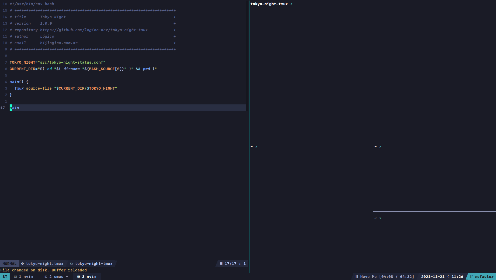

# Tokyo Night Tmux

A clean, dark Tmux theme that celebrates the lights of Downtown [Tokyo at night.](https://www.google.com/search?q=tokyo+night&newwindow=1&sxsrf=ACYBGNRiOGCstG_Xohb8CgG5UGwBRpMIQg:1571032079139&source=lnms&tbm=isch&sa=X&ved=0ahUKEwiayIfIhpvlAhUGmuAKHbfRDaIQ_AUIEigB&biw=1280&bih=666&dpr=2)



## Installation using TPM

In your `tmux.conf`:
```
set -g @plugin "sigugo/tokyo-night-tmux"
```

## Credits
- [Forked from Alejandro Amaral](https://github.com/janoamaral/tokyo-night-tmux)
